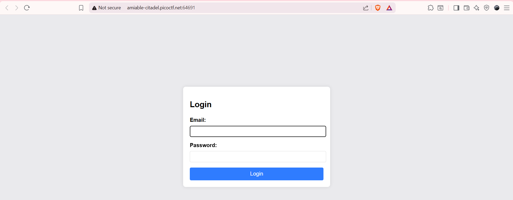
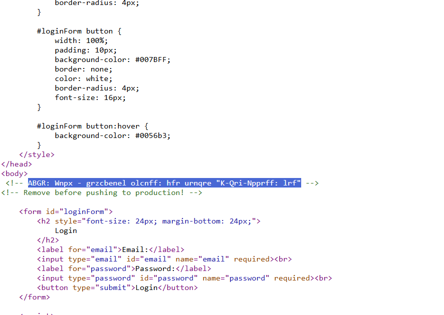
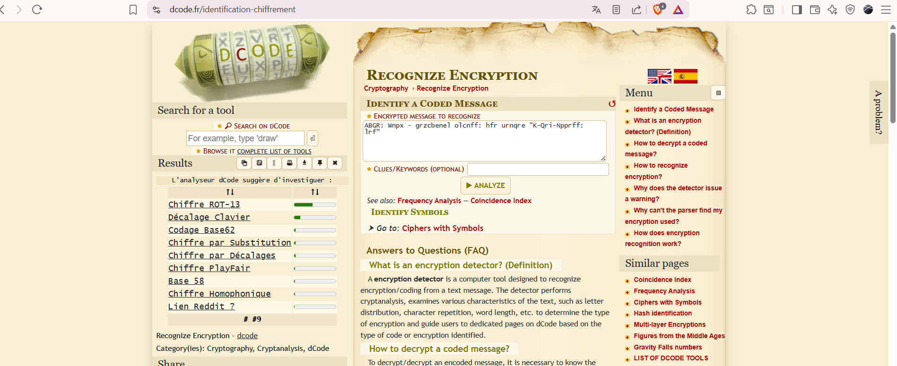
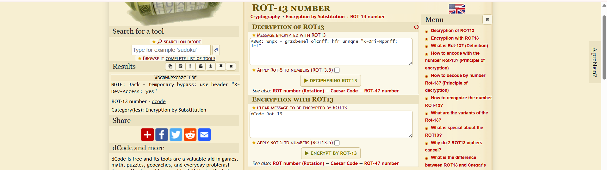
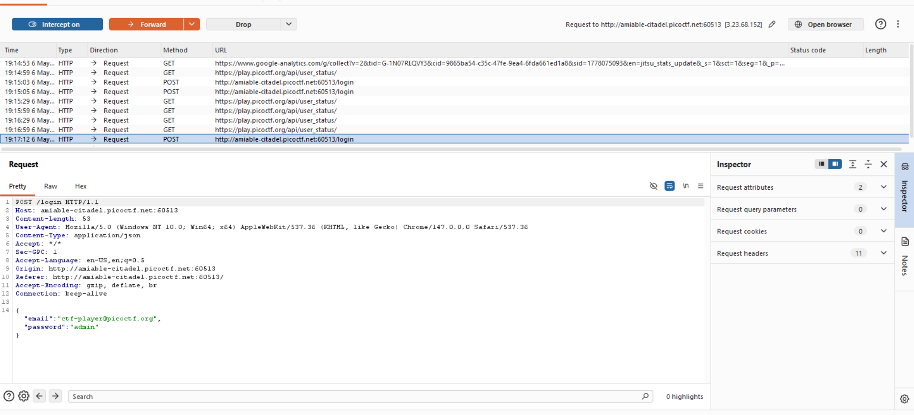
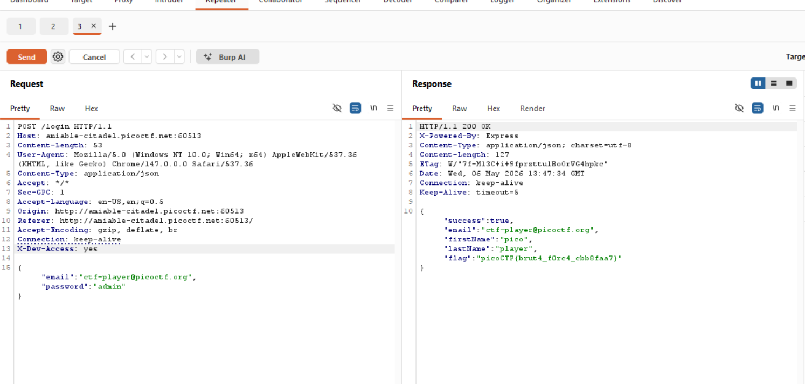

# 🔐 Crack The Gate 1 — PicoCTF Web Exploitation Writeup

<div align="center">


</div>

---

# 📌 Challenge Statement

> We’re in the middle of an investigation. One of our persons of interest, `ctf-player`, is believed to be hiding sensitive data inside a restricted web portal.
>
> We’ve uncovered the email address he uses to log in:
>
> ```txt
> ctf-player@picoctf.org
> ```
>
> Unfortunately, we don’t know the password, and the usual guessing techniques haven’t worked. But something feels off... it’s almost like the developer left a secret way in.
>
> Can you figure it out?

---

# 🎯 Objective

The objective of this challenge was to:
- Gain access to the restricted portal
- Discover hidden developer functionality
- Bypass authentication
- Capture the final flag

---

# 🖼️ Screenshots Used

| Screenshot Purpose | File Name |
|---|---|
| Challenge Information | `Challenge-Info.png` |
| Login Portal | `Accessing-Portal.png` |
| Source Code Comment | `Found-Something-In-SourceCode-Portal.png` |
| ROT13 Detection | `Decoding-Check.png` |
| ROT13 Decoded Output | `ROT13-Decodd-Output.png` |
| Burp Suite Interception | `Intercepting-Requests.png` |
| Final Flag | `Got-Flag.png` |

---

# 🖥️ Initial Access

After launching the challenge instance, we are presented with a web login portal.

The challenge already provides the email address:

```txt
ctf-player@picoctf.org
```

This strongly indicates:
- Username enumeration is not the challenge
- The password may not actually be required
- Some hidden authentication bypass mechanism may exist

---

# 🖼️ Login Portal



---

# 🔎 Initial Enumeration

Before attacking the login form directly, initial web enumeration was performed.

The following common directories and files were tested:

```bash
/robots.txt
/sitemap.xml
/admin
/secret
/flag.txt
/administrator-panel
```

However, none of them revealed anything useful.

---

# 📚 Understanding robots.txt

Even though `/robots.txt` was inaccessible in this challenge, understanding its role is extremely important.

---

## What is robots.txt?

`robots.txt` is a plain text policy file located at the root directory of a website.

Example:

```txt
https://example.com/robots.txt
```

Its purpose is to implement the:

```txt
Robots Exclusion Protocol (REP)
```

This file tells web crawlers:
- Which pages are allowed to be crawled
- Which pages should not be crawled

---

## Example robots.txt

```txt
User-agent: *
Disallow: /admin
```

Meaning:
- All crawlers (`*`)
- Should avoid crawling `/admin`

---

# 🧠 Crawling vs Indexing

One of the most important web concepts is understanding the difference between:

| Concept | Meaning |
|---|---|
| Crawling | Reading and scanning website content |
| Indexing | Saving URLs inside a search engine database |

---

## Important Observation

A page can:
- Be crawled but not indexed
- Be indexed but not crawled

---

# 🧾 X-Robots-Tag: noindex

Websites may also use:

```http
X-Robots-Tag: noindex
```

This tells search engines:
- Do not index this page

---

# ⚠️ Important Security Observation

If:
- `robots.txt` blocks crawling
- AND the page uses `noindex`

then:
- Search engines may never see the `noindex` header
- Because the crawler never accesses the page

This can accidentally expose hidden URLs.

---

# 📚 Understanding sitemap.xml

Another important discovery file is:

```txt
/sitemap.xml
```

This XML file contains:
- Important website URLs
- Pages intended for crawling

---

## Example sitemap.xml

```xml
<urlset>
   <url>
      <loc>https://example.com/login</loc>
   </url>
</urlset>
```

---

# 🧠 Observation During Enumeration

In this challenge:
- `robots.txt` was unavailable
- `sitemap.xml` was unavailable

Possible explanations:
- Files may not exist
- Files may exist on alternate routes
- Developers intentionally removed them

---

# 🔍 Inspecting the Page Source

Since direct enumeration did not reveal anything useful, the next step was:

```txt
Viewing the page source code
```

Inside the source code, a suspicious green-colored comment was discovered.

This strongly suggested:
- Hidden developer hints
- Debug comments
- Encoded instructions

---

# 🖼️ Hidden Comment Inside Source Code



---

# 🧪 Encoded Comment Discovery

The suspicious comment appeared encoded.

The encoded text was copied and analyzed using:

```txt
https://dcode.fr
```

The cipher was identified as:

# 🔐 ROT13 Cipher

---

# 📚 Understanding ROT13

ROT13 is a basic substitution cipher.

It works by:
- Shifting each alphabet character by 13 positions

---

## Example

| Original | Encoded |
|---|---|
| A | N |
| B | O |
| C | P |

---

## Example Conversion

```txt
HELLO
```

Becomes:

```txt
URYYB
```

---

# 🖼️ ROT13 Detection



---

# 🧠 Important Characteristics of ROT13

- Works only on alphabets (A-Z)
- Symmetric cipher
- Encoding and decoding use the same operation

Applying ROT13 twice returns the original text.

---

# 🔓 Decoding the Hidden Message

After decoding the comment, the following instruction was revealed:

```txt
X-Dev-Access: yes
```

This was the key to solving the challenge.

---

# 🖼️ ROT13 Decoded Output



---

# 📚 Understanding X-Dev-Access Header

The header:

```http
X-Dev-Access: yes
```

is a custom HTTP header.

---

# Why Does It Start With X- ?

Traditionally:
- `X-` was used for non-standard custom HTTP headers

Examples:
- `X-Forwarded-For`
- `X-API-Key`
- `X-Debug`

Although modern standards no longer require `X-`, many applications still use it.

---

# 🧠 What Does This Header Do?

This header likely:
- Enables developer mode
- Unlocks hidden functionality
- Bypasses restrictions
- Grants elevated access

This is a classic example of:
- Improper developer backdoor exposure

---

# 🛠️ Exploitation Using Burp Suite

The next step was intercepting the login request using Burp Suite.

---

# 📡 Capturing the Request

Steps performed:

1. Open Burp Suite
2. Enable Intercept
3. Submit the login request
4. Capture the HTTP request

---

# 🖼️ Burp Suite Interception



---

# 🔁 Sending the Request to Repeater

The intercepted request was:
- Sent to Burp Repeater

Burp Repeater allows:
- Manual request modification
- Header injection
- Replay testing

---

# ✍️ Adding the Custom Header

The following header was added manually:

```http
X-Dev-Access: yes
```

---

# 🚀 Sending the Modified Request

After forwarding the modified request:
- Authentication restrictions were bypassed
- Developer access was enabled
- The application granted access
- The flag became accessible

---

# 🏁 Flag Obtained

```txt
[FLAG REDACTED]
```

Challenge solved successfully ✅

---

# 🖼️ Final Flag



---

# 🔬 Vulnerability Analysis

| Vulnerability | Description |
|---|---|
| Hidden Developer Backdoor | Developer functionality exposed through headers |
| Authentication Bypass | Access granted without valid credentials |
| Information Disclosure | Sensitive hints leaked inside source code |
| Security Misconfiguration | Hidden debug functionality left enabled |

---

# ⚠️ Why This Vulnerability is Dangerous

Improper developer functionality exposure can lead to:
- Authentication bypass
- Privilege escalation
- Administrative compromise
- Unauthorized access
- Complete application takeover

---

# 🛡️ Recommended Mitigations

## 1. Remove Debug Functionality in Production

Developer-only features should never remain enabled in production environments.

---

## 2. Never Trust Custom Headers Alone

Authorization should always be validated securely server-side.

---

## 3. Avoid Sensitive Information in Source Code

Comments, debug data, and hidden instructions should never contain secrets.

---

## 4. Perform Security Audits

Applications should regularly be tested for:
- Hidden endpoints
- Debug headers
- Misconfigurations
- Authentication bypasses

---

# 🛠️ Tools Used

- Burp Suite
- Browser Developer Tools
- dCode.fr

---

# 🧠 What We Learned

This challenge teaches several important concepts:

| Topic | Description |
|---|---|
| Burp Suite Interception | Capturing HTTP requests |
| Burp Repeater | Modifying and replaying requests |
| Custom HTTP Headers | Hidden developer functionality |
| ROT13 Cipher | Basic encoding and decoding |
| Source Code Review | Inspecting hidden comments |
| robots.txt | Crawl management |
| sitemap.xml | URL discovery |
| Crawling vs Indexing | Search engine behavior |

---

# 📂 Suggested Directory Structure

```bash
Web-Exploitation/
│
├── Crack-The-Gate-1/
│   ├── README.md
│   │
│   ├── images/
│   │   ├── Challenge-Info.png
│   │   ├── Accessing-Portal.png
│   │   ├── Found-Something-In-SourceCode-Portal.png
│   │   ├── Decoding-Check.png
│   │   ├── ROT13-Decodd-Output.png
│   │   ├── Intercepting-Requests.png
│   │   └── Got-Flag.png
│
└── README.md
```

---

# ⚠️ Disclaimer

This writeup is created strictly for:
- Educational purposes
- Ethical hacking practice
- Cybersecurity learning

Do not attempt these techniques on systems without proper authorization.

---

# 📚 References

- OWASP Authentication Guidelines
- OWASP Security Misconfiguration
- Burp Suite Documentation
- PortSwigger Web Security Academy
- dCode.fr

---

<div align="center">

# 🚀 Keep Learning • Keep Hacking • Stay Ethical

</div>
